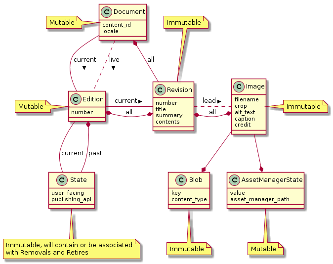
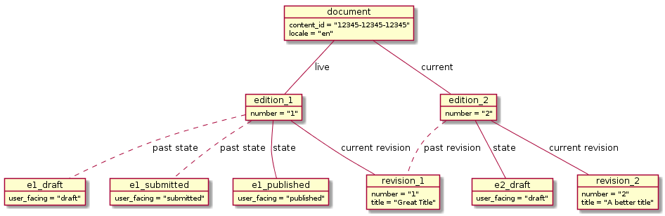
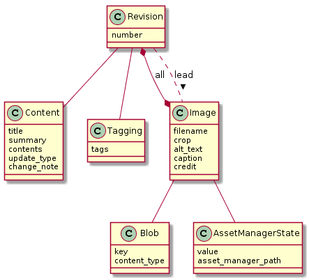
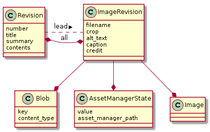
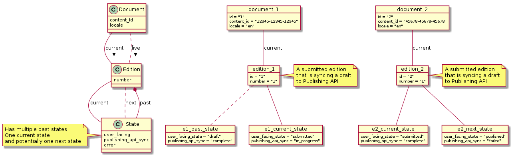

# 7. Modelling history

Date: 2018-12-17

## Context

Using terminology as defined in [ADR-3](0003-initial-domain-modelling.md):

- **Document**: A piece of content in a particular locale that can have many
versions;
- **Revision**: A particular edit of a piece of content, represents a document at
a specific point in time;
- **Edition**: A particular revision that was published to GOV.UK or is the
current draft of the document.

Content Publisher currently has a concept of a document and not editions or
revisions. A consequence of this is that an edit to a document overwrites the
previous state of the document. Since a document can exist in two forms, draft
and live, and Content Publisher only knows of one we hit problems when
knowledge of both would be useful.

The suggestion is that we enhance Content Publisher to support the concepts of
Document, Edition and Revision. The features that we'd like this to enable
are:

For a document with a live version and a draft:

- The ability to discard the draft and revert the current version in Content
  Publisher back to the live version (including all images and attachments) to
  be in sync with Publishing API;
- The ability to have the details of the live version, most noticeably state
  and URL so this can be presented to users;
- Ability to re-present either the live or draft version to Publishing API
  should there be any problems with publishing.

And with regards to history:

- To know who did what to a document and when - effectively an audit trail of
  accountability;
- Be able to compare two revisions of a document to show changes;
- Have stored in our database a full history of a document, which may go back
  further than the Publishing API (Whitehall has longer histories of some
  published documents)

A [MoSCoW](https://en.wikipedia.org/wiki/MoSCoW_method) breakdown of this
functionality was defined as:

### Must

- Store full information on current and live versions of a document
- Consider how a revision of a document and aspects of it have state that may
  change

### Should

- Have the full information for every edition that was published on GOV.UK
- Record every change a publisher makes and have that information accessible
- Consider states to be something that may change in a background job
- Avoid relying on the TimelineEntry model as the sole answer to any historical
  queries

### Could

- Link TimelineEntry to changes rather than storing the information twice
- Enable a future feature to enable reverting to different points in time
- Separate related data to different tables to reduce data usage

### Won’t

- Consider the sharing of data between translations, as per
  [ADR-3](0003-initial-domain-modelling.md#decision)

## Decision

The proposed data model expands on the definitions of entities accordingly:

**Document**: A record that represents all versions of a piece of content in a
particular locale. It has many editions and many revisions. At any time it will
have a current edition -  shown on Content Publisher index - and potentially a
live edition which is currently on GOV.UK. The live and current edition can be
the same. Document serves as a mutable entity that tracks when a Document was
last edited and it is expected to be a joining point for document related data
that is not associated with a particular editions.

**Edition**: An edition is a numbered version of a document that has been, or is
expected to be, published on GOV.UK. It is associated with a current revision
and maintains an association with all revisions that have been associated with
it. It has a current state (e.g. draft, submitted, published)
and has knowledge of the past states it held. It is mutable and is expected
as a place where any edition level database constraints can be placed.

**Revision**: Represents the content of a document at a particular point in
time. It has a number to indicate which revision of the document it is and
stores who created it. Any time a user changes an aspect of a document a new
revision is created and the current edition is updated to reference that
revision - a revision cannot be edited and is considered immutable. A revision
may have a association with a collection of items, such as images, when a new
revision is created new images are not created but a new join between them is.

This modelling is represented in the following diagram:

Note: for brevity this diagram shows a reduced selection of fields and removes
associations with Users.

The purpose of models that not described above are:

**State**: This represents the state of a document at a particular point in time,
and is associated with an edition by being the current state. This model knows
who created the state change and when. The model will likely have a polymorphic
association to an object with any specifics of the state (such as time for
scheduling, reason for retiring, etc). It is currently defined as immutable
since state changes happen atomically but may become mutable if it needs
to track an asynchronous change in Publishing API.

**Image**: Is an aspect of the current content of a document, it has a many to
many relationship with a revision (since an image could be associated with
many Revisions and a single Revision may have many images). It is immutable and
any change to an image creates a new image object. We can identify an image
replacement from a creation due to the continuous reference to a Blob. One image
can be defined as the lead image on a revision which is an optional association.

**Blob**: Blob is a model provided by [ActiveStorage][] which is used to manage
the underlying file on cloud or storage. It is already used in Content
Publisher.

**AssetManagerState**: This is a model defined to track the state of a file in
Asset Manager. It is a distinct model from Image as it is intended to be
mutable to reflect whether the editions associated with the asset are draft,
published or not. It would store whether the asset is on asset manager and any
ids/lookup data needed for asset manager. It is hoped that this model can be
shared with file attachments. Image objects that reference the same file on
asset manager can share a state.

The following diagram represents the objects of these classes to give an
example of how a document could look at a point in a life cycle:

## Status

Proposed

## Consequences

This modelling should provide a basis to provide the richer history
functionality that can enable meeting and exceeding the features offered by
Whitehall and Mainstream Publisher.

It does however come with a number of concerns that are highlighted below.

### Mo' models, mo' problems

With an increase in the number of models there is more for a developer to
understand and a higher barrier for entry. For every action there are either
more database queries or a more complicated single query to look up information.

Some ideas to alleviate this are:

- the use of [delegate][] with ActiveRecord to make it simpler to perform
  methods involved in the modelling;
- use of [scopes][] / find methods to alleviate join knowledge;
- potentially for a [materialized view][] (or
  [search index][elasticsearch-rails]) to have current and live data in a
  single table.

### There will be data repetition

By storing a variety of data on a revision directly this data will then be
replicated on the next revision which may be inefficient for data usage. This
seems a natural consequence of storing all revisions of a document without
going down a complicated route of difference storing. However an idea to
alleviate this is discussed in
[further options](#store-less-data-on-a-revision).

### We're not considering removing the past

This data model is built around the expectation that the history of documents
published to GOV.UK is something that, at this current point in time, we want to
preserve. Over time this may lead to a large amount of data usage and need
contemplating. However the evidence of 6 years of GOV.UK does not suggest that
the data usage is currently a high concern thus this design considers this a
future problem that may or may not have to be solved.

## Further options being considered

This section outlines some ideas of subtle or supporting changes to this
modelling that is being considered

### Store less data on a revision

This proposal focuses on copying a revision each time an aspect of it changes,
whether that is content, tags, or images. This would mean that if we had a 1000
word document those 1000 words would be repeated in the database for each
change to images of that document. A way to resolve this would be for a revision
to be used to just track foreign keys of different data of a document

Doing this could also give us a more granular level to know the last version
of an item for determining if a user is overwriting another users changes.

### Efficient ways to load a timeline

With the database storing quite a rich history there are options for the
timeline to associate with models directly for state. However this may not be
efficient or simple to access due to the need for many joins.

A suggestion would be that we associate a TimelineEntry model with the
associated models created in the event that created the entry but also store
a denormalised version of the data tailored for rendering the timeline. If at
any time we have to resolve an issue with incorrect TimelineEntries or want to
change their functionality we can use the associated model(s) as a source of
truth to regenerate them.

### Components of an Image (and future FileAttachment)

One of the complications we have with the Image model is that it can be
difficult to know when comparing revisions whether images are new files
or are amendments to a previous image. The suggestion to resolve this is to use
the blob id as a continuous id however this may have a cause a problem with
attachments where we may allow replacing the file.

A differing approach could be to have two models: one to represent the revision
of a file and another to represent the item as a continuous entity. This
continuous entity could be used as the id exposed to the user in the UI.

The below diagram represents this:

### Edition state changed asynchronously

This proposal mostly considers state changes to be a synchronous action in a
single request. However this is looking increasingly like something that may be
done asynchronously in order to provide accurate information.

This presents us with a challenge in that an edition can be in a transitory
state and the way we present that might differ depending on the state. For
example:

- Transitioning from draft -> submitted for 2i review. We'd consider the
  document to instantly be in submitted for 2i review state before Publishing
  API is in sync with the document, and we'd want to update the user that the
  sync is in progress or has failed.
- Transitioning from scheduled -> published. We'd consider the document to not
  be considered published until we had successfully synced the resources with
  the Publishing API. We'd want to let the user know the transition was in
  progress and whether that failed.

An approach to resolve these issues would be to:

- Track state of Publishing API sync as part of the State model associated with
  an edition - which could probably be satisfied with a value of in progress /
  failed / complete
- Ability for an Edition to also be associated with a next state, which could
  be used to demonstrate the state that an item is being transitioned to whilst
  still having it's actual state. When the sync to Publishing API is complete
  this would become the current state, if it fails then this can be shown to
  the user and re-attempted.

An example of how this could be modelled is illustrated in the following
diagram:

[ActiveStorage]: https://guides.rubyonrails.org/active_storage_overview.html
[delegate]: https://api.rubyonrails.org/classes/Module.html#method-i-delegate
[scopes]: https://guides.rubyonrails.org/active_record_querying.html#scopes
[materialized view]: https://github.com/scenic-views/scenic
[elasticsearch-rails]: https://github.com/elastic/elasticsearch-rails
