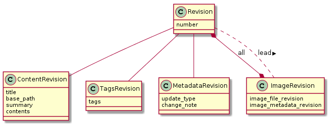
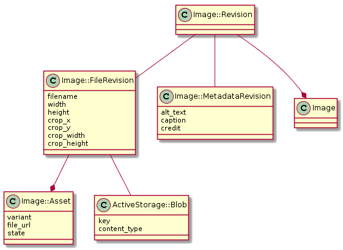
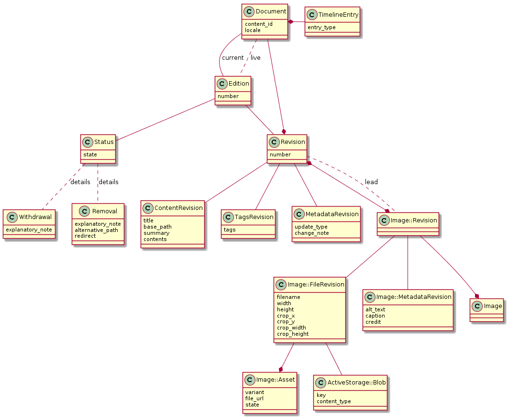

# 9. Modelling history

Date: 2018-12-17  
Amended: 2019-01-29

## Context

The Content Publisher domain model is focused on storing current
information. There is a documents table which stores the most recent content of
a document and an images table which stores the most recent version of
a document's images. History of these changes is stored using [Papertrail][],
which is not [intended as a permanent store][papertrail-pr].

The presentation of a document's history is done via a TimelineEntry model
which stores that a user did something, but lacks any further detail. In places
where richer information was required there have been models such as Removal or
Withdrawal associated with a TimelineEntry.

This has led to a number of pain points:

- users cannot discard a new draft of a published document, because creating a
  new draft overwrites the data stored for the published edition
- Content Publisher can't show an accurate link or status for the live edition
  of a document when a new draft of a published document is created;
- users cannot edit or remove images on a document once the first
  edition is published;
- the TimelineEntry model stores aspects of a document's state, resulting in it
  needing to be queried outside a timeline context which limits flexibility
  for the timeline.

And this prevents a number of intended features for Content Publisher:

- comparing different editions of a document;
- republishing live content if there are any problems (currently a common
  support task for Whitehall publisher);
- showing users what changes a user made in a particular edit.

## Decision

This ADR proposes changes to the domain model to resolve the aforementioned
pain points and provide a means to support the future intended features. These
changes provide the means to store the individual editions of a document,
each revision of the content of a document and each status an edition has held.
As per [ADR-3](0003-initial-domain-modelling.md) it does not consider the
option of sharing data between translations of a document as there are not
the appropriate product decisions for this.

A common theme in this decision is
[immutablity in models](#approach-to-mutabilityimmutability), which is used
as an implicit means of storing a history. Immutability is a key consideration
in modelling [revisions of a document](#breakdown-of-revision) and
[images](#image-modelling). This ADR then considers the impacts of
storing history for [timeline](#timeline) and [topics](#topics), both areas
where the usage/need of history is less clear. Finally, this ADR concludes with
a [collated diagram](#collated-diagram) of the domain model concepts.

### Core Concepts

**Document**: A record that represents all versions of a piece of content in a
particular locale. It has many editions and at any time it will have a current
edition - shown on Content Publisher index - and potentially a live edition
which is currently on GOV.UK. The live and current edition can be
the same. Each iteration of a document's content is represented as a revision
on the current edition, thus a document has many revisions. Document is a
mutable entity that is used to store data common across all editions (such as
first publishing date) and it is expected to be a joining point for
document-related data that is not associated with a particular edition.

**Edition**: A numbered version of a document that has been, or is
expected to be, published on GOV.UK. It is associated with a revision
and a status. It is mutable so that it can be a consistent object that
joins to immutable data. It is a place where any edition-level
database constraints can be placed, such as the constraint that only one live
edition can exist per document. It is supported that two editions of the same
document share the same revision. This allows them to explicitly reference the
same content, which supports a future ability to revert a document to past
content.

**Revision**: Represents an immutable snapshot of the content of a document at a
particular point in time. It has a number to indicate which revision of the
document it is and stores who created it. Any request by a user that changes
content should result in a single new revision. This is to directly map the
concept of a revision to each time a user revises a document. Data outside of
content, such as state, should not be stored in a revision to ensure that
differences between revisions can be represented to a user. The
[anatomy of a Revision model](#breakdown-of-revision) is explored further in
this document.

**Status**: Represents a state that an edition can hold such as: "draft" or
"submitted for review". This model is coupled to the concept of status that is
shown and changed by a user. Each time a user changes the status of an edition
a new Status model is created and the user who created it stored. An edition
can only have one status at any one time. If a status has data specific to
that status, such as an explanatory note for a withdrawal, this can be stored
in a specific model associated by a polymorphic relation. This allows for
models, such as Removal or Withdrawal, to no longer be the responsibility of
TimelineEntry. Initially this object is intended to be immutable, however this
may be changed if status changes become asynchronous operations. This is so
that a single status change performed by a user can still be represented by
a single record.

### Approach to mutability/immutability

A number of the models in Content Publisher are defined as immutable, most
significantly [Revision and associated models](#breakdown-of-revision). These
models should be persisted to the database once and never be updated or deleted.
Any need to change them requires creating a new record. This allows us to store
a full history by only appending to the database.

For simplicity, performance and consistency with Rails idioms the accessing
of immutable models is intended to be done by foreign key and not by the usage
of `SELECT MAX` style queries. This maintains the ability to use the regular
approach to ActiveRecord associations and the means to require the existence of
a association (by specifying a foreign key cannot be null). An example of this
modelling is the mutable Edition model which references an immutable model,
Revision, that stores the content. Edition is accessed by a
consistent primary key and the revision accessed by a foreign key stored on
the edition.

Since the data on a mutable model can be lost when the model is updated these
should not be used for data where there is a need for history. For example, to
store the statuses an edition has held there are individual status models that
reference the Edition. This allows an edition to reference a single status that
is replaced while a history is maintained.

The choice of this immutability strategy is to store both present and
historical concerns in the same way, thus ensuring history remains a
first class citizen. A nice side effect of having immutable models is
this opens options for caching. Since data for that
model will never change it can effectively be cached forever.

### Breakdown of Revision

As Revision is an immutable model, used to store each edit of a Document, there
is likely to be a large amount of these with often only minor differences
between them. To address this a Revision is not stored as a single model but
instead as a collection of models, where the Revision model stores little data
and joins to other models. This can be visualised as:

The intention of breaking this up is to be conservative with the amount of data
duplicated between consecutive revisions. For example when a user edits
the title of an edition a new ContentRevision is created and the existing
TagsRevision, MetadataRevision and ImageRevisions models are associated with
the next revision. An ImageRevision is modelled in a similar way to a Revision
and this is explained further in [Image modelling](#image-modelling).

It is intended that [delegation][delegate] be used when interfacing with a
revision so that the caller need not be concerned with which sub-revision
stores particular fields. This allows a revision to have a rich interface
despite storing a low amount of data directly.

### Image modelling

Content Publisher supports a user uploading image files and referencing them
in a revision of a document. They have metadata and editable properties that a
user can change, of which a history is stored. A single image file uploaded
produces multiple files that are uploaded to Asset Manager for different sizing
variations. Images are modelled in a similar way to Revision with an
immutable Image::Revision model, as represented below:

The Image model itself is used for continuation between image revisions. It is
known that two Image::Revisions are versions of the same item if they share the
same Image association. The id of the Image is used in Content Publisher URLs
to consistently reference the Image no matter which revision it is.

The data of an Image::Revision is stored between an Image::FileRevision and an
Image::MetadataRevision. Both are immutable and they differ by the fact that
any change to Image::FileRevision requires changes to the resultant Asset
Manager files (such as crop dimensions), whereas Image::MetadataRevision stores
accompanying data that doesn't affect the Asset Manager files (such as alt
text).

Each Image::FileRevision is associated with an ActiveStorage::Blob object that
is responsible for managing the storage of the source file. It also has a one
to many association with Image::Asset. Each Image::Asset represents resultant
files that are uploaded to Asset Manager for the various image sizes. The
Image::Asset model stores the URL to the Asset Manager file and what state the
file is on Asset Manager.

### Timeline

The TimelineEntry model represents an event that should be shown to a user as
part of a visual timeline of a document's history. In order for the timeline to
be a flexible feature that can be iterated, this model should not be used
outside of the timeline context. Previously models such as Removal and
Withdrawal were associated directly with a TimelineEntry which
meant state was accessed through the timeline. These are now suggested to be
associated with a Status model.

At the time of writing it wasn't yet determined what the
timeline would show, and therefore it wasn't clear exactly how
best to model an entry for it. Because of this TimelineEntry is modelled in a
speculative way with a number of references to relevant data, including a
polymorphic association for flexibility.

The TimelineEntry model should not store data which could not be
derived from other aspects of a document. This is the allow the ability to
rebuild TimelineEntry models if the needs of the timeline changed and to avoid
timeline being an aspect of a document's state.

### Topics

No data related to topics (otherwise known as GOV.UK taxonomy) is intended to
be stored in Content Publisher at this current point in time. This is due to
topics being accessed and edited by directly interacting with the Publishing
API. Other applications, notably Content Tagger, can also edit topics which has
the consequence that the Publishing API is the source of truth for this data
rather than Content Publisher.

This inconsistency makes it difficult to store the history of topics in a
reliable way. Thus, until needs are determined to store past topics, Content
Publisher will only know current topics (by querying Publishing API) and
the history of topics will not be available.

### Collated diagram

The various aspects of this decision can be collated together to be represented
in the following, somewhat daunting, diagram. It has been simplified for ease
of reading with noticeable omissions being a User model, since most models have
a creator, and the speculative joins of a TimelineEntry.

## Status

Accepted

## Consequences

This modelling should provide a basis to provide the richer history
functionality that can enable meeting and exceeding the features offered by
Whitehall and Mainstream Publisher.

It does however come with a number of concerns that are highlighted below.

### Migrating to a different database structure

The changes introduced in this ADR are a fundamental restructuring of the
database and are non-backwards compatible. The process of the adopting these
changes carries a number of risks. These are:

- time and complexity of migrating data from one structure to another,
  assuming we have production data;
- development of new features hindered by having to write code that works
  with old and new data structures, which will likely lead to a split codebase.

Both of these risks can be avoided by completing the migration as quickly
possible, before Content Publisher is deployed to production. This avoids the
need to migrate users' data and limits the time spent developing for old and
new data structures. However this would present a new risk, that code quality
may be reduced for the sake of completing the migration. This, if left
unaddressed, may eventually lead to technical debt in the application.

As the benefits of avoiding a data migration and a split codebase are high,
these will be prioritised over the concerns of code quality. The approach to
resolve code quality concerns is to identify and catalogue particular areas of
concern - using the [wall of pain][] Trello board - and then finding
opportunities to work on them around other team priorities.

### Risks of concurrent editing

An indirect consequence of these changes will be that almost all requests that
change the state of a document will involve multiple database writes. For
instance, editing the content of an edition will involve at least creating a
new revision and updating the edition to that revision. However if the
application receives concurrent write requests there are risks that data
integrity could be comprised.

For example:

- Consider an edition with one revision
- User A submits a change to the content of an edition
- User B submits a change to the tags of an edition
- A's request creates a new revision with new content built off the first
  revision
- As A's revision hasn't been saved, B's request builds a new revision
  also based off the first revision
- A's revision is saved and set to the revision of the edition
- B's revision is saved and set to the revision of the edition
- A's edits are lost

To protect against this it is suggested that [pessimistic locking][] is used
whenever mutating data related to a document (typically any non GET/HEAD
requests). This will be done by wrapping code in a database transaction and
running a `SELECT .. FOR UPDATE` query to load the document. This has the
effect of making any subsequent locking queries wait until the first transaction
is completed.

With pessimistic locking the above scenario would be:

- User A submits a change to the content of an edition and locks the document
- User B submits a change to the tags of an edition and waits for the document
  lock to be released
- A's request creates a new revision with new content built off the first
  revision
- A's revision is saved and set to the revision of the edition
- A's lock on the document is released and B locks it
- B's request builds a new revision based off user A's created revision
- B's revision is saved and set to the revision of the edition and the document
  lock is released
- B's revision reflects both changes

A consequence of this decision is that the application has a higher
vulnerability to slow requests as these will block any other edits to the
document and increase the risk of timeout errors.

This locking approach provides the means to ensure that two edits cannot occur
concurrently but does not attempt to resolve whether a form submission
considers the most recent changes to a document. For example, if user A submits
a form unbeknownst that user B has changed one of the fields since A
started editing, then A's edits will overwrite B's. This is the scenario that
[optimistic locking][] in Rails provides the means to resolve. This is a
distinct feature that should be applied to Content Publisher in the future.

### Mo' models, mo' problems

With an increase in the number of models there is more for a developer to
understand and a higher barrier for entry. For every action there are either
more database queries or a more complicated single query to look up information.

Some ideas to alleviate this are:

- the use of [delegate][] with ActiveRecord to make it simpler to access and
  update data without interacting with individual models;
- use of [scopes][] and/or find methods to alleviate join knowledge;
- A [materialized view][] or [search index][elasticsearch-rails] to have
  current and live edition data in a flat form.

### No removal of past data

This data model is built around the expectation that the history of documents
published to GOV.UK is something to be preserved. Over time this may
lead to a large amount of data usage. At some point in the future it may need
to be evaluated whether it is appropriate to have some form of archiving
strategy for older data.

[Papertrail]: https://github.com/paper-trail-gem/paper_trail
[papertrail-pr]: https://github.com/alphagov/content-publisher/pull/302
[pessimistic locking]: https://api.rubyonrails.org/classes/ActiveRecord/Locking/Pessimistic.html
[optimistic locking]: https://api.rubyonrails.org/classes/ActiveRecord/Locking/Optimistic.html
[wall of pain]: https://trello.com/b/z3EodJje/publisher-workflow-q4-2019-planning
[delegate]: https://api.rubyonrails.org/classes/Module.html#method-i-delegate
[scopes]: https://guides.rubyonrails.org/active_record_querying.html#scopes
[materialized view]: https://github.com/scenic-views/scenic
[elasticsearch-rails]: https://github.com/elastic/elasticsearch-rails
