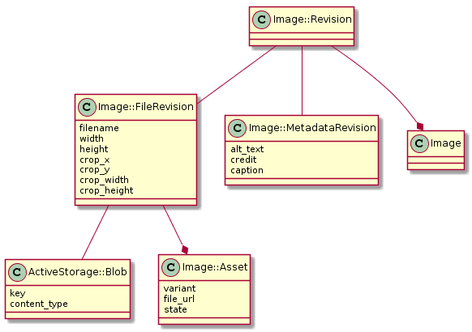
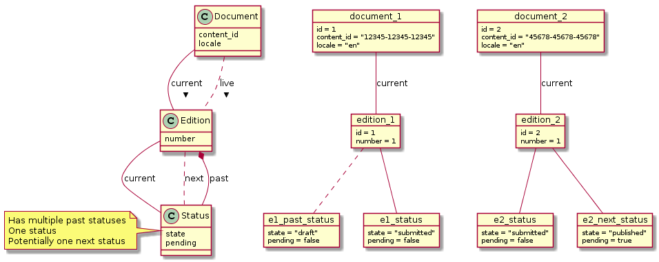

# X. Modelling history

Date: 2018-12-17
Amended: 2019-01-29

## Context

Using terminology as defined in [ADR-3](0003-initial-domain-modelling.md):

- **Document**: A piece of content in a particular locale that can have many
versions;
- **Revision**: A particular edit of a piece of content, represents a document at
a specific point in time;
- **Edition**: A particular revision that was published to GOV.UK or is the
current draft of the document.

Content Publisher currently has a concept of a document and not editions or
revisions. A consequence of this is that an edit to a document overwrites the
previous state of the document. Since a document can exist in two forms, draft
and live, we can only know about one of these at a time and not of any previous
versions.

The suggestion is that we enhance Content Publisher to support the concepts of
Document, Edition and Revision.

For a document with a live version and a draft this could enable:

- The ability to discard the draft and revert the current version in Content
  Publisher back to the live version (including all images and attachments) to
  be in sync with Publishing API;
- The ability to have the details of the live version, most noticeably state
  and URL so this can be presented to users;
- Ability to re-present either the live or draft version to Publishing API
  should there be any problems with publishing.

And with regards to history this could enable:

- A record of who did what to a document and when - effectively an audit trail
  of accountability;
- Ability to compare two revisions of a document to show changes;
- Storing in Content Publisher a full history of a document - to enable
  importing Whitehall documents with histories pre-dating the Publishing API.

A [MoSCoW](https://en.wikipedia.org/wiki/MoSCoW_method) breakdown of this
functionality is defined as:

### Must

- Store full information on current and live versions of a document;
  *because* we may need to re-present either to the Publishing API as Content
  Publisher is the source of truth.
- Consider how a revision of a document and aspects of it have state that may
  change;
  *because* the concept of revision could become convoluted if it stores
  information that a user does not directly impact.

### Should

- Have the full information for every edition that was published on GOV.UK;
  *because* this will allow us the means to show a user what changed between
  published editions - which is needed for a variety reasons, including, in
  some cases, legal.
- Record every change a publisher makes and allow for that information to be
  accessible;
  *because* this maintains options for TimelineEntry and provides rich
  debugging information.
- Avoid relying on the TimelineEntry model as the main answer to any
  historical queries;
  *because* this model is close to the user and is likely to be iterated. The
  deeper the coupling to a document the more difficult this becomes.

### Could

- Link TimelineEntry to changes rather than storing the information twice;
  *because* this would reduce concerns and opportunities for error.
- Consider states to be something that may change in a background job;
  *because* publishing can be a slow task that could timeout a single
  HTTP request, considering this up-front will be less painful than bolting it
  on.
- Enable a future feature to enable reverting to different points in time;
  *because* this could enable users to make minor changes to a live document
  and then recover a draft.
- Separate related data to different tables to reduce data usage;
  *because* storing each change a user makes could be inefficient for data
  usage.

### Won’t

- Consider the sharing of data between translations, as per
  [ADR-3](0003-initial-domain-modelling.md#decision);
  *because* there is insufficient product decisions around what translation
  needs/expectations are.

## Decision

The proposed data model expands on the definitions of entities accordingly:

**Document**: A record that represents all versions of a piece of content in a
particular locale. It has many editions and many revisions. At any time it will
have a current edition -  shown on Content Publisher index - and potentially a
live edition which is currently on GOV.UK. The live and current edition can be
the same. Document serves as a mutable entity that tracks data across all
editions (such as first publishing date) and it is expected to be a joining
point for document related data that is not associated with a particular
edition.

**Edition**: A numbered version of a document that has been, or is
expected to be, published on GOV.UK. It is associated with a revision
and a status. It is mutable and is expected as a place where any edition level
database constraints can be placed.

**Revision**: Represents the content of a document at a particular point
in time. It has a number to indicate which revision of the document it is and
stores who created it. Any time a user changes an aspect of a document a new
revision object is created and the edition is updated to reference that
revision - a revision itself cannot be edited and is considered immutable. A
revision may have a association with a collection of items, such as image
revisions, when a new revision is created new image revisions are not created
but a new join between them is. A revision has a number of components which are
described further in this document.

And, this model now has a concept of:

**Status**: Represents a particular singular state that an edition can
hold such as: draft, submitted for review, published, etc. This is typically a
field exposed to a user to explain the current editions state and provided as
a means of filtering. Each time a user performs an action which changes this
state a new status object is created. A status stores the state assigned, the
user who created it and the current revision for when it was created. It may be
associated with a more specialised model with data of a particular state.
Initially this object is intended to be immutable although this may change in
future if status changes are not synchronous.

These are represented in the following diagram:

Further details are then explained in the following sections.

### Approach to mutability/immutability

A number of the models in Content Publisher are defined as immutable, most
significantly Revision and it's associated types. These models should be
persisted to the database once and never updated or deleted, any need to change
them requires creating a new record. This allows us to store a full history
by only adding to the database.

Accessing immutable models is intended to always be done by a foreign key that
is updated and not by the usage of `SELECT MAX` style queries - which are a
common way to interact with append only database tables. This is done for
simplicity, performance and for consistency with Rails idioms. To achieve this
we maintain a number of mutable models (such as Document or Edition) that are
updated to the most recent foreign keys and themselves are not suitable vessels
for storing data that may change.

The choice of this immutability strategy is to keep the concerns of the present
and history stored in the same data stores - thus ensuring history remains a
first class citizen. A nice side effect of having immutable models is
this opens options for caching, since we know that the data for that
model will never change it can effectively be cached forever.

### Breakdown of Revision

Revision is a model that stores little data itself and joins to other models
that store the data. This can be visualised as:

The intention of breaking this up is to be conservative with the amount of data
duplicated for both storage and maintenance reasons. Thus when a user edits
the title of an edition a new ContentRevision object is created and the other
objects (TagsRevision, MetadataRevision and ImageRevisions) are associated with
the next revision.

It is intended that delegation be used when interfacing with a revision to
enable accessing data within the child objects of a revision without the caller
being directly aware of them.

### Image modelling

Images are modelled in a similar pattern to Revision. At their core is a
concept of an Image::Revision which stores joins to other models, as
represented below:

The Image model itself is used for continuation between image revisions, we know
that two Image::Revisions are versions of the same item if they share the same
Image model association.

The data of an Image::Revision is stored between an Image::FileRevision and an
Image::MetadataRevision. These two object differ by the fact that any change to
Image::FileRevision requires changes to the resultant files (such as crop
dimensions), whereas Image::MetadataRevision stores accompanying data that
doesn't affect the files (such as alt text).

Image::FileRevision is associated with an ActiveStorage::Blob object that is
responsible for managing the storage of the source file. It also has a one to
many association with Image::Asset, each of these represent resulting files that
are uploaded to Asset Manager. For a single image uploaded we'd likely upload
multiple sizes to Asset Manager - these different files are named variants. An
Image::Asset object stores whether the asset is on Asset Manager, what state it
is in and the URL.

### Timeline entry

A timeline entry represents an event that should be shown to a user as part
of a documents history. This stores the event which occurred and associations
to relevant models. This model is intended to be coupled to the representation
of document timeline to a user and is not meant to be used for any other purpose.

The TimelineEntry model should not store additional data than what could be
derived from the other aspects of history of a document so as to maintain
flexibility for timeline to be an evolving and iterated part of the
application.

At the time of working on this modelling it wasn't yet determined what the
timeline would show, and therefore it wasn't clear exactly how
best to model them. Because of this TimelineEntry will be modelled in a
speculative way with a number of joins to relevant data.

### Topics / Taxonomy

No data related to topics / taxonomy is intended to be stored in Content
Publisher at the current point in time. This is due to this being editable
from other locations, most notably Content Tagger, and therefore difficult for
us to store an accurate picture. As we learn more this may be reconsidered.

## Status

Accepted

## Consequences

This modelling should provide a basis to provide the richer history
functionality that can enable meeting and exceeding the features offered by
Whitehall and Mainstream Publisher.

It does however come with a number of concerns that are highlighted below.

### Mo' models, mo' problems

With an increase in the number of models there is more for a developer to
understand and a higher barrier for entry. For every action there are either
more database queries or a more complicated single query to look up information.

Some ideas to alleviate this are:

- the use of [delegate][] with ActiveRecord to make it simpler to perform
  methods involved in the modelling;
- use of [scopes][] / find methods to alleviate join knowledge;
- potentially for a [materialized view][] (or
  [search index][elasticsearch-rails]) to have current and live data in a
  single table.

### We're not considering removing the past

This data model is built around the expectation that the history of documents
published to GOV.UK is something that, at this current point in time, we want to
preserve. Over time this may lead to a large amount of data usage that warrants
re-consideration.

## Further options being considered

This section outlines some further options that was considered as part of this
ADR but not part of the decision and may be explored further in future.

### Efficient ways to load a timeline

With the database storing a rich history there are options for the
timeline to associate with models directly rather than store much information
directly. However this may not be efficient or simple to access due to the
need for many joins.

A suggestion would be that we associate a TimelineEntry model with the
associated models created in the event that created the entry but also store
a denormalised version of the data tailored for rendering the timeline. If at
any time we have to resolve an issue with incorrect entries or want to
change their functionality we can use the associated model(s) as a source of
truth to regenerate them.

### States changed asynchronously

This proposal mostly considers state changes to be a synchronous action in a
single request. However this is looking increasingly like something that may be
done asynchronously in order to provide timely responses and accurate
information.

This presents us with a challenge in that an edition can be in a transitory
state and the way we present that might differ depending on the status. For
example:

- Transitioning from `draft` -> `submitted_for_review`. We'd consider the
  document to instantly be in `submitted_for_review` status and no need to
  update the Publishing API.
- Transitioning from `scheduled` -> `published`. We'd consider the document to not
  be considered published until we had successfully synced the resources with
  the Publishing API. We'd want to let the user know the transition was in
  progress and whether that failed.

An approach to resolve this would be to provide the ability for an edition to
also be associated with a next status. This could be used to present the
status that an item is being transitioned to whilst still maintaining it's
current status. When the sync to Publishing API is complete the next status
could replace the editions status, if it fails then this can be shown to the
user and re-attempted.

An example of how this could be modelled is illustrated in the following
diagram:

[delegate]: https://api.rubyonrails.org/classes/Module.html#method-i-delegate
[scopes]: https://guides.rubyonrails.org/active_record_querying.html#scopes
[materialized view]: https://github.com/scenic-views/scenic
[elasticsearch-rails]: https://github.com/elastic/elasticsearch-rails
